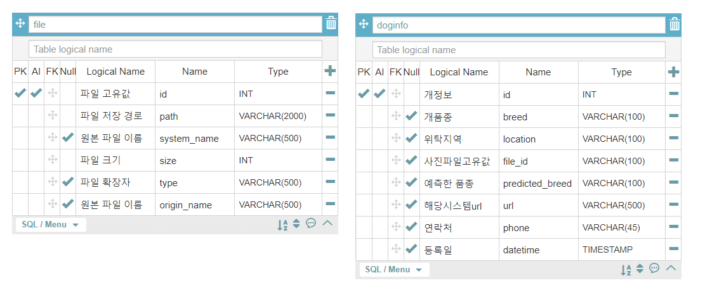
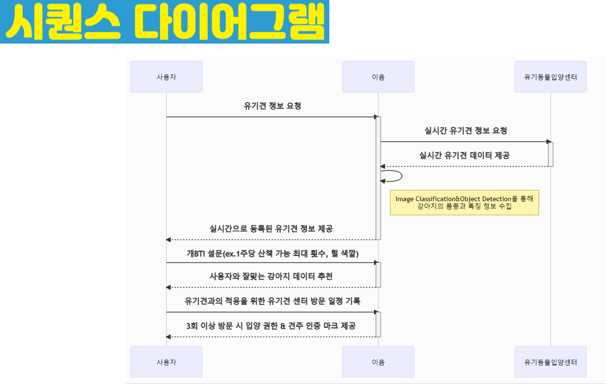
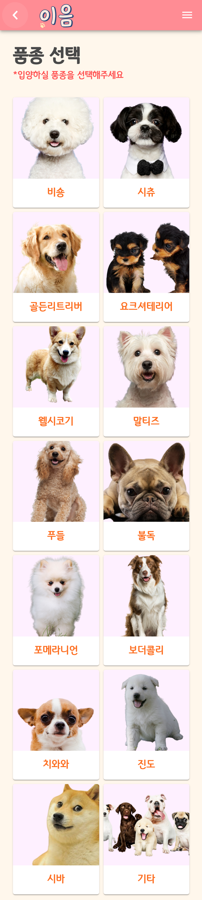
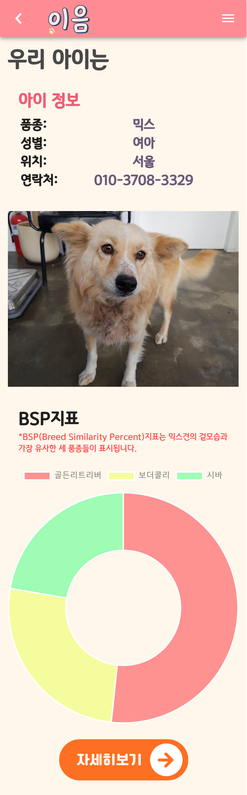

> SSAFY Team 3 
>
> 인공지능 PTJ

# 🐶 이음 (Eum)


------

#### | 이음 :: MDTI(MyDogTypeIndecator)로 사용자의 성향에 맞는 반려견을 추천하고 Classification을 통해 유기견의 품종을 예상할 수 있게하고 입양을 도와주는 서비스 🐕‍🦺


## 🔧 Architecture

**Entitiy Relationship Diagram**




**Sequence Diagrams**




------


### 📦 Requirements
> * Node Package Module
> * MySQL
> * Python 3.6
> * JDK 1.8


## 📚 install

```bash
$ git https://lab.ssafy.com/s04-ai-speech-sub3/s04p23d103.git
```

```bash
$ yarn install
```


### 1. database

> ###### ieum.sql을 참조 하여 데이터 베이스 생성 


### 2. backend server run
> ###### application.yml 에서 database 설정 변경
> ###### 빌드 & 실행
```bash
$ ./gradlew build
$ java -jar [filename].jar
```


### 3. frontserver server run
> ###### backend server 에 맞춰 api 요청 주소 변경

```bash
$ yarn run serve
```


## 🔬 classification dataset

> ###### stanford dogs dataset 과 Tsinghua dogs dataset 에서 사진을 선별하고 진돗개 이미지를 추가해 135개의 개 종류에 대해 68,569 장의 이미지를 가진 전용 데이터셋을 만듬 

### 🧬classification 학습 모델 

> ###### ImageNet으로 pre-trained 된 Inception V1 모델을 사용


------


## 🎨 Feature


### 📝 MDTI Solution

> MDTI(My Dog Type  Indicator)검사의 채점방식을 어떻게 처리하였는 지에 대한 설명입니다.


#### 📃 MDTI Questionnaire

> MDTI검사의 질문과 선택지를 표로 나타내었을 때와 구현한 코드입니다.

| Question No. |                질문                | 선택지                                                       | Key             |
| :----------: | :--------------------------------: | :----------------------------------------------------------- | :-------------- |
|      Q1      |       반려견의 털이 빠진다면       | ① 상관없다<br />② 어느 정도 괜찮다<br />③ 예민하다           | O<br />O<br />X |
|      Q2      | 함께 살기에 적당한 반려견의 크기는 | ① 5kg 이하 소형견<br />② 10kg 안팎의 중형견<br />③ 15kg 이상 대형견 | X<br />X<br />O |
|      Q3      |     하루에 산책 가능한 시간은      | ① 집 주변에서 가벼운 산책<br />② 2시간 이상 산책             | O<br />X        |
|      Q4      |    우리집 반려견이 짖는 정도는     | ① 많이 짖지 않았으면 좋겠다<br />② 짖음 훈련으로 극복 가능하다 | X<br />O        |
|      Q5      |     가족이 집을 비우는 경우는      | ① 가족이 집에 있는 경우가 많다<br />② 때때로 모두 집을 비운다 | X<br />O        |
|      Q6      |   키우고 싶은 반려견의 이미지는    | ① 인기 많은 품종 중 하나였으면<br />② 내가 좋다면 아무래도 상관없다 | O<br />X        |

```javascript
 questions: [ 	//question: 질문; no: QuestionNo; props: 선택지; correct: Key; accuracy: 정확도 
            {
              question: "반려견의 털이 빠진다면...",
              propositions: [
                { no: 11, props: "상관없다", correct: true, accuracy: 0.93 },
                { no: 12, props: "어느 정도 괜찮다", correct: true, accuracy: 0.81 },
                { no: 13, props: "예민하다", correct: false, accuracy: 0.93 },
              ],
              solved: false,
            },
            {
              question: "함께 살기에 적당한 반려견의 크기는...",
              propositions: [
                { no: 21, props: "5kg 이하 소형견", correct: false, accuracy: 0.93},
                { no: 22, props: "10kg 안팎의 중형견", correct: false, accuracy: 0.71},
                { no: 23, props: "15kg 이상 대형견", correct: true, accuracy: 0.93},
              ],
              solved: false,
            },
            {
              question: "하루에 산책 가능한 시간은...",
              propositions: [
                { no: 31, props: "집 주변에서 가벼운 산책", correct: true, accuracy: 0.93 },
                { no: 32, props: "2시간 이상 산책", correct: false, accuracy: 0.93 },
              ],
              solved: false,
            },
            {
              question: "우리집 반려견이 짖는 정도는...",
              propositions: [
                { no: 41, props: "많이 짖지 않았으면 좋겠다", correct: false, accuracy: 0.93,},
                { no: 42, props: "짖음 훈련으로 극복 가능하다", correct: true, accuracy: 0.93, },
              ],
              solved: false,
            },
            {
              question: "가족이 집을 비우는 경우는...",
              propositions: [
                { no: 51, props: "가족이 집에 있는 경우가 많다.", correct: false, accuracy: 0.93, },
                { no: 52, props: "때때로 모두 집을 비운다.", correct: true, accuracy: 0.55 },
              ],
              solved: false,
            },
            {
              question: "키우고 싶은 반려견의 이미지는...",
              propositions: [
                { no: 61, props: "인기 많은 품종 중 하나였으면", correct: true, accuracy: 0.93, },
                { no: 62, props: "내가 좋다면 아무래도 상관없다.", correct: false, accuracy: 0.93, },
              ],
              solved: false,
            },
          ],
```


#### 🐶 품종별 Question's Key

> 품종에 따라 질문에 해당되는 key값
>
> ex) 비숑에 적합한 견주는 털빠짐에 예민하며, 소형견을 선호하고, 가벼운 산책을 즐기며, 많이 짖지않으며, 집에 있는 시간이 많고, 인기있는 품종을 선호하는 사람에 해당될 것입니다. 따라서 다음 표와 같은 값을 가지게 됩니다.

|                  |  Q1  |  Q2  |  Q3  |  Q4  |  Q5  |  Q6  |
| :--------------: | :--: | :--: | :--: | :--: | :--: | :--: |
|     **비숑**     |  X   |  X   |  O   |  X   |  X   |  O   |
|     **시츄**     |  O   |  X   |  O   |  X   |  O   |  X   |
| **골든리트리버** |  O   |  O   |  X   |  O   |  O   |  O   |
| **요크셔테리어** |  X   |  O   |  O   |  X   |  O   |  X   |
|   **웰시코기**   |  X   |  X   |  O   |  X   |  O   |  O   |
|    **말티즈**    |  O   |  X   |  O   |  O   |  X   |  X   |
|     **푸들**     |  X   |  X   |  O   |  O   |  X   |  O   |
|     **불독**     |  X   |  O   |  O   |  X   |  O   |  O   |
|  **포메라니안**  |  O   |  X   |  O   |  O   |  X   |  O   |
|   **보더콜리**   |  O   |  O   |  X   |  X   |  O   |  X   |
|     **시바**     |  X   |  X   |  X   |  X   |  O   |  O   |
|     **진도**     |  X   |  X   |  X   |  O   |  O   |  X   |
|    **치와와**    |  X   |  X   |  O   |  O   |  X   |  X   |

```javascript
dogsMdti: [     //MDTI에서 활용되는 품종에따른 질문에따른 답(Answer the Question)
            {breed: "비숑", AtQ: [false, false, true, false, false, true] },
            {breed: "시츄", AtQ: [true, false, true, false, true, false] },
            {breed: "골든리트리버", AtQ: [true, true, false, true, true, true] },
            {breed: "요크셔테리어", AtQ: [false, true, true, false, true, false] },
            {breed: "웰시코기", AtQ: [false, false, true, false, true, true] },
            {breed: "말티즈", AtQ: [true, false, true, true, false, false] },
            {breed: "푸들", AtQ: [false, false, true, true, false, true] },
            {breed: "불독", AtQ: [false, true, true, false, true, true] },
            {breed: "포메라니안", AtQ: [true, false, true, true, false, true] },
            {breed: "보더콜리", AtQ: [true, true, false, false, true, false] },
            {breed: "시바", AtQ: [false, false, false, false, true, true] },
            {breed: "진도", AtQ: [false, false, false, true, true, false] },
            {breed: "치와와", AtQ: [false, false, true, true, false, false] },
        ],
```


#### 📊 ScoreBoard

> 품종에 따라 점수를 매길 수 있는 점수판입니다. 점수가 가장 높을 수록 설문자와 적합한 품종입니다.

|           | 비숑 | 시츄 | 골든리트리버 | 요크셔테리어 | 웰시코기 | 말티즈 | 푸들 | 불독 | 포메라니안 | 보더콜리 | 시바 | 진도 | 치와와 |
| :-------: | :--: | :--: | :----------: | :----------: | :------: | :----: | :--: | :--: | :--------: | :------: | :--: | :--: | :----: |
| **score** |  0   |  0   |      0       |      0       |    0     |   0    |  0   |  0   |     0      |    0     |  0   |  0   |   0    |

```javascript
mdtiScoreboard: [   //MDTI에서 작성된 설문을 바탕으로 유저와 가장 맞는 강아지를 추천해주기위한 점수판
          {breed: "비숑", score: 0},
          {breed: "시츄", score: 0},
          {breed: "골든리트리버", score: 0},
          {breed: "요크셔테리어", score: 0},
          {breed: "웰시코기", score: 0},
          {breed: "말티즈", score: 0},
          {breed: "푸들", score: 0},
          {breed: "불독", score: 0},
          {breed: "포메라니안", score: 0},
          {breed: "보더콜리", score: 0},
          {breed: "시바", score: 0},
          {breed: "진도", score: 0},
          {breed: "치와와", score: 0},
        ],
```


#### 💯MDTI 채점방식

> `MDTI Questionnaire`의 선택지에서 고른 Key값과  `품종별 Question's Key`와 비교하여 일치하면 해당되는 품종들을 `ScoreBoard`에 score를 1씩 증가시킵니다. 문제수를 거듭할 수록 설문자에게 맞는 품종의 score가 많이 쌓이게 됩니다. 그리고 score를 기준으로 내림차순으로 정렬하여 앞쪽부터 순위 별로 설문자에게 추천됩니다.

```javascript
calculateResult({state, commit}){
          var my_answers = state.myAnswers;	//MDTI Questionnaire의 선택지에서 고른 Key값들
          var dogs_mdti = state.dogsMdti;	//품종별 Question's Key
          var mdti_score_board = state.mdtiScoreboard;	//ScoreBoard
          for(var i = 0; i < my_answers.length; i++ ){
            for(var j = 0; j < dogs_mdti.length; j++ ){
              if(!(my_answers[i] ^ dogs_mdti[j].AtQ[i])){	//XNOR연산(같으면 true, 다르면 false)
                mdti_score_board[j].score++;	//해당되는 품종들의 score를 1씩 증가
              }
            }
          }
          mdti_score_board.sort(function(a, b) {  //내림차순으로 정렬
            return b["score"] - a["score"];
          });
          commit('SET_MDTI_RESULT', res )
        }
```

------


### 🐕 품종별 입양하기

#### 🐾 품종 선택

> 모든 유기견의 정보는 [종합유기견 보호센터](https://www.zooseyo.or.kr/)에서 크롤링하므로 실제 입양을 기다리는 유기견들을 보여준다



#### 🔎 상세페이지

> BSP지수 (Breed Specific Percent) 
>
> :: Classification을 통해 해당 유기견의 외형과 가장 닮은 3종을 수치로 환산하여 도넛차트로 표시



#### 👨‍👧‍👦 입양하기

> 입양은 해당 유기견을 관리하는 유기견센터 페이지로 이동하여 이루어진다


------


## 🏓 Contributer

#### 프론트 : 		조현섭

#### 백엔드 : 		김성실, 지승윤, 이수민

#### 인공지능 : 	지서연
